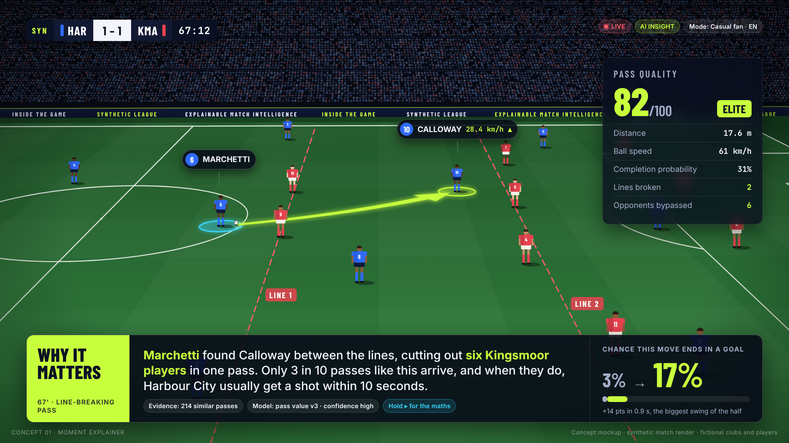

# Inside the Game: research, ideas and concept mockups

Pre-build research for our entry to the **Microsoft Premier League Hackathon** ("Inside the Game", submissions 6–27 Oct 2026). The challenge: turn **synthetic** football events into explainable match intelligence, real-time narratives and personalised experiences for studio, broadcast and streaming.

> **Status:** research and ideation (round 1). Nothing here is the product yet. Every image is a concept mockup rendered from synthetic data with fictional clubs and players.



## Start here

| If you have… | Read |
|---|---|
| 5 minutes | The deck (link shared separately) or [`ideas/shortlist-and-recommendation.md`](ideas/shortlist-and-recommendation.md) |
| 30 minutes | + [`ideas/idea-catalogue.md`](ideas/idea-catalogue.md) and the mockups in [`mockups/png/`](mockups/png/) |
| An afternoon | + the seven research reports below |

## What's in the repo

```
research/        Seven deep-research reports (sources inline, claims tagged [V] verified / [U] unverified)
  01-premier-league-landscape.md     Microsoft × PL partnership, data providers, Data Zone, broadcasters, gaps
  02-big-five-leagues.md             Bundesliga × AWS, LaLiga × Microsoft, Serie A, Ligue 1, UEFA/FIFA/MLS
  03-cross-sport-inspiration.md      NFL, NBA, F1, tennis, cricket, Olympics, esports, accessibility
  04-data-and-footage-sources.md     What data/footage we can legally use; synthetic generation; event schema
  05-azure-microsoft-stack.md        Foundry, Agent Framework, MCP, real-time stack, costs, risks, learning path
  06-competitive-landscape-and-research.md   Vendors, open source (with licences), papers, competitor repos
  07-hackathon-intel.md              Rules decoded, past winners' patterns, video playbook, IP safe harbour
ideas/
  idea-catalogue.md                  50 ideas in six themes, each mapped to stages, precedent, Azure, prizes
  shortlist-and-recommendation.md    Scoring, four flagship concepts, recommendation, MVP cut lines, plan, decisions
architecture/
  tech-stack.md                      Proposed Azure-native stack, agent roster, overlay cue contract, practices
  azure-learning-plan.md             Learn-by-building plan for getting good at Azure during the hackathon
mockups/
  NN-*.html                          20 concept mockups (static HTML)
  png/                               Rendered 1920×1080 PNGs
  assets/pitch.js                    Synthetic broadcast renderer (virtual camera over synthetic tracking)
  assets/theme.css                   Shared visual language
  STORY_BIBLE.md                     The fictional universe: clubs, players, scoreline, personas
  render.mjs                         Re-render all mockups: `node mockups/render.mjs [filter]`
```

## The mockups

| # | Concept | # | Concept |
|---|---|---|---|
| 01 | Moment Explainer ("why it matters") | 11 | Funday / kids cast |
| 02 | Control vs Chaos match pulse | 12 | Pundit Debate (grounded personas) |
| 03 | Fan Lens: one event, two experiences | 13 | Half-time Pack |
| 04 | Player Focus mode | 14 | Audio-described cast |
| 05 | Polyglot localisation | 15 | Ask the Match (MCP-grounded Q&A) |
| 06 | Studio Copilot (producer console) | 16 | Shot DNA (explainable xG) |
| 07 | The Agent Newsroom (agent ops) | 17 | Recap Factory |
| 08 | Scenario Lab (synthetic match engine) | 18 | Edge-of-Seat alerts |
| 09 | Vision loop (auto-eventing on synthetic video) | 19 | The Pass Not Played (counterfactual) |
| 10 | Catch Me Up | 20 | Reference architecture |

Re-render after editing: `node mockups/render.mjs` (uses Playwright + Chromium; fonts load from Google Fonts).

## Headline findings

1. Microsoft's PL partnership (July 2025) promised **"real-time data overlays and post-match analysis"** on Foundry; what has shipped so far is conversational (Companion, FPL Companion, Copilot on *The Overlap*).
2. On-screen data today shows **numbers, not reasons**, and it is the same for every viewer.
3. 10+ competitor repos were public on day one with a common template (multi-agent + fact-checker + personas + translation + momentum). Doing the brief well is table stakes.
4. **No dataset is provided** and popular open data (StatsBomb) is off-limits for a commercially licensed entry. A credible synthetic engine is a differentiator *and* a scored criterion.
5. **Recommendation:** build *the explain layer between match data and every screen*: a Director agent with broadcast grammar, a why-engine with counterfactuals, per-viewer overlays on a synthetic broadcast picture, and a producer approving what airs.

## Ground rules we're holding ourselves to

Synthetic data only · fictional clubs, players and league (no real marks or likenesses) · no betting framing · prebuilt voices only, no impersonation · every on-screen claim backed by event IDs · never overclaim in the README or video.

## Caveats

The research was run with restricted web access: many sites were blocked for direct fetching and the search budget was limited. Claims are tagged **[V]** (verified against a source or its search summary) or **[U]** (unverified background knowledge). Check [U] items before quoting them to judges. Two research agents briefly used GitHub search beyond this repository early on; this is how the official rules repo and competitor repos were found, and the reports disclose it.
