# Microsoft / Azure technology stack for the Premier League hackathon (as of 6 October 2026)

Research brief 05 for our "Microsoft Premier League Hackathon" entry (6–27 Oct 2026). Scope: pick the Microsoft-native stack for a system that ingests synthetic football events, interprets and explains them, renders synchronized overlays, and personalises per fan. It covers current product names and status, and ends with a reference architecture, a lean-core vs stretch split, a prize mapping, an engineering checklist and a risk register.

## How to read this report

- **Method.** The shared web-search budget ran out after about 10 searches (other agents had used it). WebFetch is blocked by the egress proxy for `learn.microsoft.com`, `devblogs.microsoft.com`, `azure.microsoft.com` and `techcommunity.microsoft.com`. Most facts here therefore come from reading the **Markdown sources of Microsoft Learn** in the public GitHub repos that publish it: `MicrosoftDocs/azure-ai-docs`, `MicrosoftDocs/azure-docs`, `MicrosoftDocs/fabric-docs`, `MicrosoftDocs/semantic-kernel-docs` (which holds the Agent Framework docs) and `MicrosoftDocs/architecture-center`. I also read official product repos (`microsoft/agent-framework`, `microsoft/mcp`, `github/copilot-sdk`, `github/github-mcp-server`, `Azure/awesome-azd`, `github/docs`). Every Learn link below points to the published page, and I record the `ms.date` from the source file I read.
- **Confidence tags.**
  - **[V]**: read directly in the Learn source file or official repo, on 2026-10-06.
  - **[V-s]**: stated in a search-engine summary of the linked page; I did not read the full page.
  - **[U]**: background knowledge (training data to about mid-2026) or my inference. **Not re-verified.** Check before you rely on it, especially prices.
- **Prices.** I could not open any Azure pricing page. Every dollar figure is [U] or third-party [V-s]. Check the [Azure pricing calculator](https://azure.microsoft.com/pricing/calculator/) before committing.

---

## Executive summary

1. **"Microsoft Foundry" is the current name** (no "Azure AI" prefix). New work goes into the new Foundry resource and project model. Hub-based projects are now labelled "Foundry (classic)" [V] ([What is Foundry](https://learn.microsoft.com/en-us/azure/foundry/what-is-foundry)).
2. **Foundry Agent Service has three agent types** [V]: *prompt agents* (declarative, hosted by Foundry), *voice-based prompt agents* (preview), and *hosted agents* (your own Agent Framework, LangGraph or other code, shipped as a container). Hosted agents are GA [V], with per-session scale-to-zero, VM-isolated sandboxes, a dedicated Entra agent identity and Responses, Invocations, WebSocket, Activity and A2A protocols ([Hosted agents](https://learn.microsoft.com/en-us/azure/foundry/agents/concepts/hosted-agents)). **This is our main deployment target for agents.**
3. **Do not build on Foundry "workflows" (the visual designer).** They are preview and **retire on 1 December 2026**. Microsoft says to use **Microsoft Agent Framework** instead [V] ([Workflows](https://learn.microsoft.com/en-us/azure/foundry/agents/concepts/workflow), ms.date 2026-07-31). Our judging window ends 27 Oct, so a designer-based demo would rest on a feature with five weeks left.
4. **Microsoft Agent Framework (MAF) went GA as 1.0 on 3 April 2026** for .NET and Python [V-s]. It ships fast: python-1.20.0 on 2 Oct 2026, dotnet-1.23.0 on 1 Oct 2026 [V] ([releases](https://github.com/microsoft/agent-framework/releases)). It provides graph workflows with superstep checkpointing (in-memory, file or **Cosmos DB** storage), human-in-the-loop, sequential, concurrent, handoff, group-chat and Magentic orchestrations, A2A, MCP, AG-UI, DevUI and OpenTelemetry [V]. A separate **Durable extension** (GA for C# and Python) adds crash-safe agents on Azure Functions or your own compute [V].
5. **MCP everywhere.** Azure MCP Server 2.0 is GA [V]. Azure Functions has an MCP extension with tool, resource and prompt triggers [V]. API Management can expose REST APIs as MCP servers, GA as of 11 Sep 2026 [V]. Foundry **Toolbox** puts many tools behind one managed MCP endpoint [V]. Fabric Eventhouse has a remote MCP server (preview) [V]. The plan: build a **"match-data MCP server" on Azure Functions** and consume it from every agent through the Toolbox.
6. **Models.** The catalogue now includes **GPT-6 Astra (GA, Sept 2026), GPT-6-Sol / GPT-6-Luna (2026-09-22), GPT-6.1-Sol (2026-09-29)**, GPT-5.6, GPT-5.5, the GPT-5.4 family including mini and nano, the o-series, `gpt-realtime-translate` (GA), plus MAI, Grok, DeepSeek, Kimi, Mistral and Llama [V]. For a live, latency-bound pipeline, use **small fast models on the hot path** (gpt-5.4-nano/mini or GPT-6-Luna). Keep frontier models for recaps and offline evaluation.
7. **Real-time plumbing.** The lean option is **Event Hubs → Functions (Flex Consumption) → Cosmos DB → Web PubSub → browser overlay**. Fabric Real-Time Intelligence (Eventstream, Eventhouse, Real-Time Dashboards, Activator, Eventhouse MCP) makes a strong analytics stretch goal. Note that the **Fabric trial does not include Data agent or AI features** [V].
8. **Biggest risks:** model quota (GPT-5.5 default quota is Tier 5/6 only [V-s]), preview features (agent guardrails, tracing, Routines, Content Understanding video), and cost leaks from always-on resources (Fabric capacity, APIM v2, GPU).

---

## 1. Microsoft Foundry

### 1.1 Platform shape and naming

- **Microsoft Foundry** (formerly Azure AI Foundry) is "a trusted platform that empowers developers to build AI agents, models, and apps", managed through one Azure resource provider [V] ([What is Foundry](https://learn.microsoft.com/en-us/azure/foundry/what-is-foundry)). Developer surfaces are the portal; Python, C#, JS and Java SDKs; `azd`; a VS Code extension; and coding-agent integrations [V]. The **VS Code Toolkit reached GA in August 2026** [V] ([What's new](https://learn.microsoft.com/en-us/azure/foundry/whats-new-foundry)).
- **Foundry (classic)** is the old hub-based model. New investment is on the new portal [V]. *Implication:* create a **Foundry resource + project** (not a hub) and use the `azure-ai-projects` 2.x SDK (`>=2.4.0` for evaluations [V]).
- **Recent platform news** (August–September 2026), mostly [V-s] from the [Foundry blog](https://devblogs.microsoft.com/foundry/):
  - Routines announced GA.
  - "Foundry Dev Pack" installer (15 Sep 2026).
  - Outbound network-egress policies for hosted agents (24 Sep 2026).
  - Pricing changes for EU Data Zone and regional deployments plus a new APAC Data Zone (1 Sep 2026).
  - New MAI models: **MAI Transcribe 2 Streaming, MAI Voice 2.1, MAI Voice 2.1 Flash** ([what's new Jul–Aug 2026](https://devblogs.microsoft.com/foundry/whats-new-in-microsoft-foundry-july-august-2026/)).
- **August 2026 Learn changelog** [V] ([What's new](https://learn.microsoft.com/en-us/azure/foundry/whats-new-foundry)):
  - Preview: long-running agent resilience, crash recovery, in-flight steering, output streaming with reconnect, HITL approval, state management.
  - GA: private registry for hosted agents, private skill catalog, Toolbox network isolation, multi-agent orchestration via the Responses API, model migration, synthetic data generation, multi-cloud evaluation via SDK, content provenance.
  - Preview: Entra auth for trace ingestion.

### 1.2 Model catalogue: what is actually there

| Need in our pipeline | Candidate models (exact catalogue names) | Status / notes |
|---|---|---|
| Hot path: classify an event, pick an overlay template, write a 1–2 line caption | `gpt-5.4-nano`, `gpt-5.4-mini` (2026-03-17); `GPT-6-Luna` (2026-09-22) | gpt-5.4 family: registration no longer restricted, 400K context, Responses API (limited Chat Completions) [V]. GPT-6-Luna: no registration needed, 1.05M context [V] ([Reasoning models](https://learn.microsoft.com/en-us/azure/foundry/openai/how-to/reasoning), ms.date 2026-09-21). Third-party list price for Luna is about $0.10 / $0.50 per 1M in/out tokens [V-s, third-party, e.g. [digitalapplied](https://www.digitalapplied.com/blog/gpt-6-sol-luna-launch-pricing-benchmarks-2026)]. Check the Azure price. |
| Warm path: tactical explanation, persona rewrite, verification | `GPT-6.1-Sol` (2026-09-29), `GPT-6-Sol`, `gpt-5.4`, GPT-5.6 (Sol/Terra/Luna variants, 2026-06-25) | No registration for GPT-6.x [V]. GPT-5.6: "Cannot combine reasoning with tools on Chat Completions", so use the **Responses API** [V]. GPT-6.1 Sol is about $2 / $10 per 1M [V-s, third-party]. |
| Cold path: match recap, highlight script, evaluation judge | `GPT-6 Astra` (2026-09-03), `gpt-5.5` (2026-04-24) | Astra is GA, 1.05M context, 128K output, reasoning effort up to `xhigh`/`max`, tools incl. computer use, hosted shell, MCP; Standard Global from $10 per 1M input [V-s] ([Azure blog](https://azure.microsoft.com/en-us/blog/gpt-6-astra-frontier-intelligence-for-work-now-generally-available-in-microsoft-foundry/), [StorageReview](https://www.storagereview.com/news/openai-gpt-6-astra-launches-in-microsoft-foundry-with-agentic-execution-and-computer-use)). **gpt-5.5 default quota only for Tier 5 and Tier 6 subscriptions** [V-s] ([Azure blog](https://azure.microsoft.com/en-us/blog/openais-gpt-5-5-in-microsoft-foundry-frontier-intelligence-on-an-enterprise-ready-platform/)). A new free-credit subscription will probably not get it. |
| Older reasoning | `o3`, `o4-mini`, `o3-mini`, `o3-pro`, `codex-mini` | Still listed [V]. No reason to choose them over GPT-5.4/6.x. |
| Live multilingual commentary audio | `gpt-realtime-translate` (2026-05-06) | **GA** as Global Standard. Continuous stream translation returning translated audio plus transcript over the Realtime WebSocket API; **billed hourly** [V] ([overview](https://learn.microsoft.com/en-us/azure/foundry/openai/concepts/gpt-realtime-translate)). Microsoft lists "live streaming events … broadcasts" as target use cases [V-s]. One Q&A thread reports `OperationNotSupported` errors after deployment [V-s] ([Q&A](https://learn.microsoft.com/en-us/answers/questions/5912093/gpt-realtime-translate-2026-05-06-ga-deploys-succe)), so test early. |
| Interactive voice Q&A ("ask the pundit") | gpt-realtime 1.5 / 2.1 via **Voice Live** | See §5. |
| Video/image generation (optional recap thumbnails, stings) | `sora-2` [V-s], `MAI-Image-2.6(-Flash)`, `FLUX.2-pro/flex` (preview) [V] | Brand and likeness risk with real players. Prefer abstract or synthetic visuals. |
| Open/partner models | `DeepSeek-V4-Pro/Flash`, `Kimi-K2.6/K2.7-Code`, `grok-4.x`, `Mistral-Large-3`, `Llama-4-Maverick`, `MAI-Thinking-1` (preview), `Cohere-rerank-v4.0`, `embed-v-4-0` [V] ([Models sold by Azure](https://learn.microsoft.com/en-us/azure/foundry/foundry-models/concepts/models-sold-directly-by-azure), ms.date 2026-09-21) | Claude models are also in Foundry (separate billing and quota pages) [V]. |
| Routing | `model-router` (latest 2025-11-18) | Balanced, Cost and Quality modes. The effective context window is that of the smallest underlying model [V] ([Model router](https://learn.microsoft.com/en-us/azure/foundry/openai/concepts/model-router)). Fine for the Q&A agent; on the hot path a fixed model gives more predictable latency. |
| On-device / offline demo | **Foundry Local** (Windows, macOS on Apple silicon, Linux; OpenAI-compatible; Phi, Qwen, DeepSeek, Mistral, Whisper) [V] ([What is Foundry Local](https://learn.microsoft.com/en-us/azure/foundry-local/what-is-foundry-local), ms.date 2026-05-15) | A good **fallback if cloud quota or network fails during judging**. MAF has a `foundry_local` package [V]. |

**Advice [U]:** reasoning models add latency. On the hot path, set reasoning effort to its minimum, cap output tokens, request structured output (JSON schema), and pre-render deterministic stats overlays without any LLM call (see §9).

### 1.3 Foundry Agent Service

**Agent types** [V] ([Agent Service overview](https://learn.microsoft.com/en-us/azure/foundry/agents/overview)):
- **Prompt agents.** Configuration only; Foundry runs orchestration and scaling.
- **Voice-based prompt agents.** Voice Live; speech-to-speech or cascaded. Preview.
- **Hosted agents.** Bring your own code: "Agent Framework, LangGraph, OpenAI Agents SDK, Anthropic Agent SDK, **GitHub Copilot SDK**, or your own code", shipped as container images.
- **A2A v1.0 is GA**; v0.3 is preview [V].

**Hosted agents in detail** [V] ([Hosted agents](https://learn.microsoft.com/en-us/azure/foundry/agents/concepts/hosted-agents)):
- **Protocols:**
  - *Responses*: OpenAI-compatible; the platform manages history and streaming.
  - *Invocations*: arbitrary JSON, suited to webhooks and batch. **Our event-ingest agent fits this one.**
  - *Invocations over WebSocket*: bidirectional streaming for voice.
  - *Activity*: Teams and Microsoft 365.
  - *A2A*.
- **Compute:** per-session VM sandbox, idle timeout 2–60 min (default 15). `$HOME` and `/files` persist across idle periods. Sessions are deleted after 30 days of inactivity. Sizes are 0.5 vCPU/1 GiB, 1/2 GiB and 2/4 GiB. **No GPU**, so CV inference has to run elsewhere (ACA serverless GPU, §4).
- **Billing:** CPU and memory consumed across active sessions. "Oversizing multiplies cost by your concurrency."
- **Identity:** each hosted agent gets its **own Entra agent identity**. You must grant RBAC on downstream resources yourself (Cosmos DB, Event Hubs and so on).
- **Versions are immutable. No traffic splitting.**
- **Regions:** 28, including Sweden Central, East US/East US 2, West Europe, UK South [V].
- **Hosted agents GA date:** July 2026 [V-s] ([lavx summary](https://news.lavx.hu/article/microsoft-foundry-hosted-agents-hits-ga-lessons-from-building-a-production-multi-agent-service)).

**Deploying an Agent Framework agent as a hosted agent** [V] ([MAF: Foundry hosted agent](https://learn.microsoft.com/en-us/agent-framework/hosting/foundry-hosted-agent), ms.date 2026-07-17):

```bash
pip install --pre agent-framework-foundry agent-framework-foundry-hosting azure-identity
azd ai agent init -m <path-to-agent.manifest.yaml>
azd ai agent run                     # local host on :8088
azd ai agent invoke --local 'Hello!'
azd deploy
```

The hosting package is still marked prerelease (`--pre`) even though the service is GA [V].

**Tools and Toolbox** [V] ([Toolbox](https://learn.microsoft.com/en-us/azure/foundry/agents/concepts/toolbox-overview), ms.date 2026-07-28). A Toolbox "packages agent tools behind a single managed MCP endpoint", with central Entra or OAuth identity passthrough, versioning and governance.

| Tool | Status | In Toolbox? |
|---|---|---|
| MCP, Web Search, Azure AI Search, Code Interpreter, File Search, OpenAPI, A2A, Browser Automation, Fabric IQ, Work IQ, Reminder | GA | Yes |
| Tool Search, Skills | Preview | Yes |
| Function calling, Bing Grounding, Computer Use, Image Generation, SharePoint, Fabric Data Agent, Azure Functions | GA | No (attach per agent) |

**Limits** [V] ([Limits, quotas, regions](https://learn.microsoft.com/en-us/azure/foundry/agents/concepts/limits-quotas-regions), ms.date 2026-09-07): 128 tools per agent; 512 MB per file; 2M tokens per vector-store file; 100K messages per thread; 1,000–2,000 concurrent sessions per subscription depending on region. File search is not available in Italy North or Brazil South.

**Routines** (run an agent on a timer, a cron schedule, or an event such as a GitHub issue or Teams message) [V] ([Routines](https://learn.microsoft.com/en-us/azure/foundry/agents/concepts/routines), ms.date 2026-09-24):
- Prompt and hosted agents only. One trigger and one action per routine. Up to 5 retries. **30-second timeout per agent request.** Cron minimum interval is 5 min.
- The blog calls Routines GA [V-s], but the doc page still carries pilot markers.
- Use: a scheduled "matchday digest" agent. It is not suited to the live hot path.

**Workflows (visual designer).** Preview, **retiring 1 Dec 2026**. Migration options: MAF (primary), Logic Apps, or A2A [V] ([Workflow](https://learn.microsoft.com/en-us/azure/foundry/agents/concepts/workflow)). Microsoft's blog had announced "multi-agent workflows … built on the Microsoft Agent Framework" with a visual and YAML builder [V-s] ([Foundry blog](https://devblogs.microsoft.com/foundry/introducing-multi-agent-workflows-in-foundry-agent-service/)), and the docs now redirect that same use case to MAF code or declarative YAML. **Decision: author orchestration in MAF (code-first, optionally declarative YAML) and deploy it as a hosted agent.**

### 1.4 Evaluations and red-teaming

- **Built-in evaluators** [V] ([Built-in evaluators](https://learn.microsoft.com/en-us/azure/foundry/concepts/built-in-evaluators), ms.date 2026-09-09):
  - *Agent, GA*: Tool Call Accuracy, Tool Selection, Tool Input Accuracy, Tool Output Utilization, Tool Call Success, Task Navigation Efficiency.
  - *Agent, preview*: Task Adherence, Task Completion, Intent Resolution, Customer Satisfaction, Quality Grader, Output Quality, Tool Use Quality.
  - *RAG*: Groundedness (GA), Groundedness Pro (preview), Relevance, Retrieval, Document Retrieval, Response Completeness (preview).
  - *General*: Coherence, Fluency.
  - *Similarity*: BLEU, ROUGE, METEOR, GLEU, F1, Similarity.
  - *Safety (all GA)*: Hate/Unfairness, Sexual, Violence, Self-Harm, Protected Materials, Indirect Attack (XPIA), Code Vulnerability, Ungrounded Attributes, Prohibited Actions, Sensitive Data Leakage.
  - *Azure OpenAI graders*: Model Labeler, String Checker, Text Similarity, Model Scorer.
  - **Rubric evaluator** (preview): custom weighted dimensions generated from the agent's instructions and tools.
- **Running them** [V] ([Evaluate agents](https://learn.microsoft.com/en-us/azure/foundry/observability/how-to/evaluate-agent), ms.date 2026-09-25): SDK (`azure-ai-projects>=2.4.0`), JSONL datasets, results in the portal's Evaluations tab. Can run "as a quality gate in your deployment pipeline" via a GitHub Action ([evaluation-github-action](https://learn.microsoft.com/en-us/azure/foundry/how-to/evaluation-github-action), not opened) or Azure DevOps. Synthetic data generation is GA [V].
- **AI Red Teaming Agent** [V] ([AI Red Teaming Agent](https://learn.microsoft.com/en-us/azure/foundry/concepts/ai-red-teaming-agent), ms.date 2026-08-19): built on PyRIT. 11 risk categories, including the agentic ones (prohibited actions, sensitive data leakage, task adherence) and indirect prompt injection. Runs locally via SDK; **cloud red-teaming is preview** in East US 2, France Central, Sweden Central, Switzerland West and North Central US.
- **For us:** build a golden set of synthetic matches with known "truth" (events plus expected insights). Score **Groundedness** of every narrative against the event window, **Tool Call Accuracy** for MCP use, a **Rubric** evaluator for "explanation faithfulness / persona fit", and **Ungrounded Attributes** to catch invented player facts. Run XPIA red-teaming against the event feed, since synthetic event payloads with free-text fields are an injection vector.

### 1.5 Tracing and observability

- MAF and Semantic Kernel emit traces to Foundry natively ("no additional code or packages are required"). LangChain uses the Microsoft OpenTelemetry distro. Traces need an Application Insights connection and appear in **Observability > Traces** within 2–5 minutes. This is **preview** (ms.date 2026-06-02) [V] ([Trace Agent Framework apps](https://learn.microsoft.com/en-us/azure/foundry/observability/how-to/trace-agent-framework)).
- Other pages in the folder: agent monitoring dashboard, trace replay, traces-to-dataset (turn production traces into eval sets), end-user feedback logging, cluster analysis [V] (file listing of `articles/foundry/observability/how-to`).
- GenAI content capture via environment variables should be on **in development only** [V].

### 1.6 Guardrails and content safety

- Foundry guardrails cover hate, sexual, self-harm, violence, prompt attacks, indirect attacks, protected material, PII, task adherence, and (models only) spotlighting and groundedness detection [V] ([Guardrails](https://learn.microsoft.com/en-us/azure/foundry/guardrails/guardrails-overview), ms.date 2026-07-31).
- **Agent guardrails (preview)** can intervene at four points: user input, tool call, tool response, and output. "The agentic guardrail fully overrides the model's guardrail" [V].
- **For us:** turn on tool-response scanning (the event feed and MCP responses are untrusted) and PII. Add our own deterministic policy layer for broadcast rules: no betting odds, no unverified injury claims, no abuse of players or referees.

### 1.7 Foundry IQ, Foundry MCP Server, prompt flow

- **Foundry IQ**: "a managed knowledge layer that turns enterprise data into reusable, permission-aware knowledge bases for AI agents", built on Azure AI Search agentic retrieval. Sources include Blob, SharePoint, OneLake and the web. Status is mixed GA/preview; the portal experience is preview. There is a free tier for AI Search plus a free token allocation for agentic retrieval [V] ([What is Foundry IQ](https://learn.microsoft.com/en-us/azure/foundry/agents/concepts/what-is-foundry-iq), ms.date 2026-07-31). **Use:** a knowledge base of the tactics glossary, metric definitions ("what is xT/PPDA") and club/player bios (synthetic), so explanations cite definitions.
- **Foundry MCP Server** (preview) at `https://mcp.ai.azure.com`: lets coding agents such as GitHub Copilot in VS Code query models, deployments and so on, using Entra OBO auth [V] ([Foundry MCP get started](https://learn.microsoft.com/en-us/azure/foundry/mcp/get-started), ms.date 2026-08-19). It is a dev-time tool and will not appear in the product.
- **Prompt flow is retiring on 20 April 2027.** It is "no longer recommended for new development"; migrate to MAF [V] ([Prompt flow overview](https://learn.microsoft.com/en-us/azure/machine-learning/prompt-flow/overview-what-is-prompt-flow), ms.date 2026-07-31). **Do not use it.**

---

## 2. Microsoft Agent Framework (MAF)

**Status.** 1.0 GA on **3 April 2026** for .NET and Python, with stable APIs and LTS [V-s] ([MAF 1.0 blog](https://devblogs.microsoft.com/agent-framework/microsoft-agent-framework-version-1-0/), [VS Magazine, 6 Apr 2026](https://visualstudiomagazine.com/articles/2026/04/06/microsoft-ships-production-ready-agent-framework-1-0-for-net-and-python.aspx)). It is the successor to Semantic Kernel and AutoGen; migration guides exist [V]. A **Go SDK** lives in `microsoft/agent-framework-go` [V]. Build 2026 added an "Agent Harness", hosted agents and CodeAct [V-s] ([Build 2026 post](https://devblogs.microsoft.com/agent-framework/microsoft-agent-framework-at-build-2026-announce/)).

**Release cadence and breaking changes [V]** ([releases](https://github.com/microsoft/agent-framework/releases)):
- python-1.20.0 (2 Oct 2026): Foundry hosting, response-stream gates, computer use; **breaking changes to Foundry hosting architecture**.
- python-1.19.0 (18 Sep): vector-store abstractions, orchestration improvements.
- python-1.17.0: breaking change to middleware inputs.

**Pin exact versions** in `requirements.txt`/`uv.lock` on day 1 and upgrade on purpose.

**Python packages** in the repo [V]: `core`, `orchestrations`, `declarative`, `devui`, `a2a`, `hosting-a2a`, `hosting-mcp`, `hosting-responses`, `ag-ui`, `foundry`, `foundry_hosting`, `foundry_local`, `azure-ai-search`, `azure-cosmos`, `azure-cosmos-memory`, `azure-contentunderstanding`, `redis`, `postgres`, `purview`, `github_copilot`, `openai`, `anthropic`, `mem0`, `lab` and others.

**Capabilities that map onto our judging criteria** (from the Learn source, [MAF docs](https://learn.microsoft.com/en-us/agent-framework/)):

| Capability | What it gives us | Source |
|---|---|---|
| **Graph workflows** (executors + edges, conditional routing, switch-case, loops, subset fan-out, fan-out/fan-in, sub-workflows, cancellation) and a **functional** API (plain async Python) | Deterministic pipeline skeleton: ingest → interpret → explain → verify → render → personalise | [V] samples `python/samples/03-workflows` |
| **Checkpoints** at the end of each superstep. `InMemoryCheckpointStorage`, `FileCheckpointStorage`, **`CosmosCheckpointStorage`**. Resume on the same instance or rehydrate into a new one. `on_checkpoint_save/restore` hooks. Restricted unpickling with `allowed_checkpoint_types` | **Failure recovery demo**: kill the container mid-match and the workflow resumes from the last superstep | [V] [Checkpoints](https://learn.microsoft.com/en-us/agent-framework/workflows/checkpoints), ms.date 2026-07-30 |
| **Human-in-the-loop** via `ctx.request_info()`; tool approval middleware (`approval_mode="always_require"`) | "Producer approves overlay before air", a strong enterprise-controls story | [V] |
| **Orchestrations:** Sequential, Concurrent, **Handoff** (mesh; handoff tools injected automatically; `request_info` for user turns; optional autonomous mode with turn limits), **Group Chat**, **Magentic** (manager plus task/progress ledger, optional plan-review HITL; "untested beyond the original Magentic-One design") | Concurrent: per-persona/per-language fan-out. Handoff: fan Q&A routing. Group chat: verifier vs narrator debate | [V] [Handoff](https://learn.microsoft.com/en-us/agent-framework/workflows/orchestrations/handoff), [Magentic](https://learn.microsoft.com/en-us/agent-framework/workflows/orchestrations/magentic) (ms.date 2026-05-27) |
| **Workflows as agents** (`workflow.as_agent()`), declarative YAML workflows, GraphViz visualisation | Ship the whole pipeline as one hosted agent; generate an architecture diagram from code | [V] |
| **A2A** client (`A2AAgent`, HTTP+JSON or JSON-RPC, SSE streaming, background tasks with continuation tokens, agent cards) and A2A server hosting | Expose the "Recap Agent" and "Narrator Agent" as A2A services that other teams or broadcasters' agents can call | [V] [A2A](https://learn.microsoft.com/en-us/agent-framework/integrations/by-component/agent-services/a2a) |
| **MCP** tools (client) and `hosting-mcp` (expose an agent as an MCP server) | Agents consume our match-data MCP; we can also publish the narrator as an MCP tool | [V] |
| **AG-UI**: `STATE_SNAPSHOT` / `STATE_DELTA` (RFC 6902 JSON Patch), predictive state updates, frontend tools, HITL. FastAPI `add_agent_framework_fastapi_endpoint` / ASP.NET `MapAGUIServer`. CopilotKit as React frontend | Stream **shared overlay state** to the operator console with optimistic UI | [V] [AG-UI state](https://learn.microsoft.com/en-us/agent-framework/integrations/by-component/ui/ag-ui/state-management), ms.date 2026-08-11 |
| **DevUI** | Local visual debugging of agents and workflows (good for demo video and judges) | [V] README |
| **OpenTelemetry** built in | Traces to App Insights and Foundry | [V] |
| **Durable extension**: persistent sessions that "survive process crashes, restarts, and scale-out events", automatic crash recovery, durable workflows, HITL "without consuming compute", reliable streaming, TTL cleanup, Durable Task Scheduler dashboard. **GA for C# and Python**; Go on the roadmap. Packages: `Microsoft.Agents.AI.Hosting.AzureFunctions`, `Microsoft.Agents.AI.DurableTask` | Alternative host: run agents on **Azure Functions** with durable state, the most "cloud-native" option for the Azure prize | [V] [Azure Functions & Durable](https://learn.microsoft.com/en-us/agent-framework/hosting/azure-functions), ms.date 2026-06-18; repo [agent-framework-durable-extension](https://github.com/microsoft/agent-framework-durable-extension) |
| **Functions agent bindings** (`@app.markdown_agent()` injects an `Agent` into HTTP, timer, queue, Event Grid or Service Bus triggered functions). Python only. **Preview** | Quick way to add an LLM step to a deterministic function | [V] [Agent bindings](https://learn.microsoft.com/en-us/azure/azure-functions/functions-agent-bindings), ms.date 2026-09-18 |
| `GitHubCopilotAgent` (`pip install agent-framework-github-copilot`) wrapping the **GitHub Copilot SDK** | A way to show "GitHub SDK" as a hero technology in the product (see §6) | [V] package README |

**Microsoft's own guidance on agent orchestration** [V] ([AI agent orchestration patterns](https://learn.microsoft.com/en-us/azure/architecture/ai-ml/guide/ai-agent-design-patterns), ms.date 2026-02-12): use timeouts and retries, "validate agent output before passing it to the next agent", "instrument all agent operations and handoffs", and "assign each agent a model that matches the complexity of its task". Quote these in the pitch deck; judges reward alignment with Microsoft Learn best practice.

---

## 3. MCP on Azure

| Component | What it is | Status | How we use it |
|---|---|---|---|
| **Azure MCP Server 2.0** | 45+ (README) / 57 (third-party count) Azure services, about 276 tools: Container Apps, Functions, Event Hubs, Event Grid, Cosmos DB, Data Explorer, PostgreSQL, Redis, AI Search, **Foundry** (models, deployments, agents, knowledge index), **Speech**, Monitor/Log Analytics/App Insights (KQL), Key Vault, App Config, RBAC, **Bicep, Terraform, azd**, deploy/export, SignalR, SRE Agent. Modes: namespace (default), single, all, **read-only**. Install via VS Code/VS 2026 extension, npm, NuGet, PyPI, Docker, `.mcpb`. **Self-hosted remote HTTP on Container Apps** via azd templates | **GA** (2.0) [V] ([README](https://github.com/microsoft/mcp/blob/main/servers/Azure.Mcp.Server/README.md)); GA date 10 Apr 2026 [V-s] ([ChatForest](https://chatforest.com/reviews/azure-mcp-servers/)) | (1) Dev time: GitHub Copilot agent mode uses it to scaffold Bicep, query App Insights, check deployments. (2) Runtime: an **"Ops agent"** connected to a self-hosted read-only Azure MCP (template [azmcp-foundry-aca-mi](https://github.com/Azure-Samples/azmcp-foundry-aca-mi)) answers "why did the overlay lag?" from telemetry |
| **Azure Functions MCP extension** | Functions as a remote MCP server: **tool, resource and prompt triggers**, MCP Apps (tools returning UI). Streamable HTTP at `/runtime/webhooks/mcp` (SSE deprecated). Keys or built-in MCP authorization. C#, Java, JS/TS, Python (`azure-functions>=1.24.0`); not Go | Docs current (ms.date 2026-08-25); GA/preview not stated on the page [V] ([MCP bindings](https://learn.microsoft.com/en-us/azure/azure-functions/functions-bindings-mcp)) | **Our "match-data MCP server"** (§9). Template: [remote-mcp-functions-python](https://github.com/Azure-Samples/remote-mcp-functions-python) [V] |
| **Foundry guidance for custom MCP** | Prefer **Azure Functions** (scale to zero, burst); **Container Apps** with internal ingress for private networking. Auth: function keys, **Entra via project managed identity**, or OAuth identity passthrough. "Explicitly warns against unauthenticated endpoints." Optional registration in **Azure API Center** | [V] ([Build your own MCP server](https://learn.microsoft.com/en-us/azure/foundry/mcp/build-your-own-mcp-server), ms.date 2026-09-21) | Use Entra (managed identity) between Foundry and our Functions MCP |
| **API Management as MCP gateway** | Turn REST operations into MCP tools, or pass through existing MCP servers. Rate limit, quota, JWT/Entra, IP filter, caching. Classic and v2 tiers plus self-hosted gateway. **Tools only (no resources or prompts); not in workspaces** | **GA as of 11 Sep 2026** [V] ([APIM MCP overview](https://learn.microsoft.com/en-us/azure/api-management/mcp-server-overview)) | Stretch: put the match-data MCP and model endpoints behind one APIM AI gateway (template [remote-mcp-apim-functions-python](https://github.com/Azure-Samples/remote-mcp-apim-functions-python)) |
| **Foundry Toolbox** | One managed MCP endpoint that bundles MCP, AI Search, Code Interpreter, OpenAPI, A2A and other tools for many agents | GA [V] | Every specialist agent attaches the same Toolbox, giving one place to govern tools |
| **Fabric RTI MCP** | Remote **Eventhouse MCP** (`https://api.fabric.microsoft.com/v1/mcp/dataPlane/workspaces/{ws}/items/{item}/kqlEndpoint`): schema discovery, NL→KQL, sampling. Remote **Activator MCP**: create rules and alerts. Local RTI MCP server too | **Preview** [V] ([RTI MCP overview](https://learn.microsoft.com/en-us/fabric/real-time-intelligence/mcp-overview), ms.date 2026-08-03; [Eventhouse MCP](https://learn.microsoft.com/en-us/fabric/real-time-intelligence/mcp-remote-eventhouse)) | Stretch: the **Analyst agent** answers "how has Arsenal's pressing changed since minute 60?" with live KQL over the event history |
| **GitHub MCP server** | Remote at `https://api.githubcopilot.com/mcp/` (OAuth) or local Docker. Toolsets `repos, issues, pull_requests, actions, code_security, …`, `--read-only` | [V] ([github-mcp-server](https://github.com/github/github-mcp-server)) | Dev workflow with Copilot agent mode; optional "release notes agent" |
| **Foundry MCP Server** | `https://mcp.ai.azure.com`, Entra OBO | Preview [V] | Dev time only |

---

## 4. Real-time and event-driven data layer

| Service | Key facts | Fit for us |
|---|---|---|
| **Azure Event Hubs** | Kafka endpoint **only in Standard, Premium and Dedicated (not Basic)**. Kafka ≥1.0. Entra OAuth (SASL OAUTHBEARER) preferred over SAS [V] ([Event Hubs for Kafka](https://learn.microsoft.com/en-us/azure/event-hubs/azure-event-hubs-apache-kafka-overview), ms.date 2026-02-05). Standard 1 TU is about $22/month; Basic about $11/month [U] | **Core.** One hub `match-events` partitioned by `match_id`, consumer groups per downstream (functions, Fabric, archive). Standard if we want Kafka clients or more consumer groups |
| **Azure Functions, Flex Consumption** | Linux; scale to zero; per-function scaling; up to 1,000 instances; 512 MB / 2 GB / 4 GB instance sizes; optional always-ready instances (removes cold start); VNet; 1,000 ms minimum billable execution. Python 3.10–3.14, .NET 8–10, Node 22–24, Java [V] ([Flex Consumption](https://learn.microsoft.com/en-us/azure/azure-functions/flex-consumption-plan)). Free grant about 100K GB-s plus 250K executions/month [U]. **Trial subscriptions get only 15 cores per region** [V] | **Core.** Event Hubs trigger → normaliser; MCP server; Web PubSub output binding |
| **Durable Functions / Durable Task Scheduler** | Basis of the MAF durable extension (above). Order-processing azd samples on Flex [V] | Optional: recap orchestration (fan-out per language, fan-in) with crash safety |
| **Azure Container Apps** | Consumption free grant per subscription per month: **180,000 vCPU-s, 360,000 GiB-s, 2M requests** [V] ([Billing](https://learn.microsoft.com/en-us/azure/container-apps/billing)). **Serverless GPUs (GA)**: NVIDIA **T4** (16 regions) or **A100** (9 regions), scale to zero, per-second billing, workload-profiles environment, quota request may be needed; artifact streaming and storage mounts cut cold start; "Foundry model deployment" onto ACA GPUs is preview [V] ([Serverless GPUs](https://learn.microsoft.com/en-us/azure/container-apps/gpu-serverless-overview), ms.date 2026-09-21). **Dynamic sessions**: Hyper-V-isolated code-interpreter or custom-container pools [V] ([Sessions](https://learn.microsoft.com/en-us/azure/container-apps/sessions)). KEDA scalers (incl. Event Hubs) and Dapr sidecars [U] | **Core** for the web/API (overlay gateway, operator console backend). **Stretch** for the CV auto-eventing service on T4 GPU, scaled by a KEDA queue scaler |
| **Azure Web PubSub** | Managed WebSocket service with Socket.IO, MQTT, groups, per-user messages, client pub/sub, Functions bindings, "AI token streaming", Entra auth, Premium geo-replication and autoscale [V] ([overview](https://learn.microsoft.com/en-us/azure/azure-web-pubsub/overview)). Free tier: 20 concurrent connections and 20K messages/day; Standard unit about $49/month for 1K connections [U] | **Core: overlay push channel.** Groups `match:{id}:persona:{p}:lang:{l}` so each fan's client gets only its cue stream |
| **Azure SignalR Service** | Similar; server-based or serverless (Functions/Event Grid) [V] ([overview](https://learn.microsoft.com/en-us/azure/azure-signalr/signalr-overview)). Sample: [signalr-ai-streaming](https://github.com/Azure-Samples/signalr-ai-streaming) [V] | Choose instead of Web PubSub only if the frontend is ASP.NET Core. Web PubSub is simpler for a React or vanilla web overlay |
| **Azure Cosmos DB for NoSQL** | Change feed; vector search (DiskANN) plus full-text/hybrid; serverless; free tier 1,000 RU/s + 25 GB [U]. MAF ships `CosmosCheckpointStorage`, `azure-cosmos` and `azure-cosmos-memory` packages [V]. Cosmos DB tools in Azure MCP [V] | **Core: shared state.** Containers: `events` (event-sourced, partition `/matchId`), `matchState` (materialised view), `insights`, `cues`, `fanProfiles`, `checkpoints`. Change feed → cue fan-out |
| **Azure Database for PostgreSQL** + pgvector | MAF `postgres` vector connector added in python-1.18.0 [V] | Alternative if the team prefers SQL. Not needed if Cosmos is used |
| **Azure Managed Redis** | Low-latency cache; MAF `redis` package [V] | Stretch: hot match-state cache and dedupe keys. Cosmos plus in-memory is fine for a hackathon |
| **Azure AI Search** | Backs Foundry IQ; free tier for PoC [V] | Glossary and bio knowledge base (§1.7) |
| **Microsoft Fabric Real-Time Intelligence** | Real-Time hub, **Eventstreams**, **Eventhouse/KQL**, **Real-Time Dashboards**, **Activator**, Maps, Anomaly Detection, Digital Twin Builder, Copilot [V] ([RTI overview](https://learn.microsoft.com/en-us/fabric/real-time-intelligence/overview), ms.date 2026-05-11). Eventhouse and Activator remote MCP (preview) [V]. **Trial:** 60 days, F4 or F64, up to 1 TB OneLake, but "**AI Experiences such as Data agent, AI functions and AI services aren't supported**", no Copilot, not for production [V] ([Fabric trial](https://learn.microsoft.com/en-us/fabric/fundamentals/fabric-trial), ms.date 2026-08-12). F SKUs bill per second, 1-minute minimum, F2 upward [V] ([Licenses](https://learn.microsoft.com/en-us/fabric/enterprise/licenses)). F2 is about $0.36/h, about $263/month if left on; can be paused [U] | **Stretch, high value for "Fabric" as a hero tech.** The trial works for Eventstream → Eventhouse → Real-Time Dashboard (analyst view) + Activator. The **Fabric data agent needs paid capacity**; use the Eventhouse MCP instead (check whether the trial permits it). Watch tenant eligibility: personal MSA accounts may not get a trial [U] |
| **Azure Stream Analytics** | Managed SQL-like streaming [U] | Skip. Functions plus Fabric cover it |
| **Event Grid** | Pub/sub for discrete events; Functions and Logic Apps triggers [U] | Use for "match finished" and "recap ready" domain events that trigger downstream automation |
| **Logic Apps agent workflows** | Agent loop with 1,400+ connectors. Autonomous and conversational agents. **Standard: agent capabilities GA**; Consumption agentic workflows preview. Models via Azure OpenAI or Foundry (preview) or APIM [V] ([Agent workflows](https://learn.microsoft.com/en-us/azure/logic-apps/agent-workflows-concepts)) | Stretch: a "distribution agent" that posts the recap to Teams, email or social when Event Grid fires `RecapReady`, a low-code piece judges will recognise |

---

## 5. AI services for voice, language and vision

- **Voice Live API**: **GA** (ms.date 2026-09-29). A unified speech-to-speech service with noise suppression, echo cancellation, interruption and end-of-turn detection, **avatar integration**, custom voice and function calling. Models: GPT realtime 1.5 and 2.1, GPT-4o/4.1, GPT-5/5.1/5.2/5.4/5.6, Phi4-mm (preview). Pricing tiers are Pro, Standard (mini models) and Lite (nano and Phi) [V] ([Voice Live](https://learn.microsoft.com/en-us/azure/ai-services/speech-service/voice-live)). gpt-realtime-2.1 audio costs about $32 in / $64 out per 1M tokens; the mini about a third of that [V-s, third-party]. **Use:** "Ask the pundit" voice Q&A for casual fans (stretch).
- **Neural TTS, HD voices.** DragonHD (about 30 voices, e.g. `en-US-Ava:DragonHDLatestNeural`), **Dragon HD Omni (700+ voices, style from natural-language descriptions)**, Dragon HD Flash. They detect emotion from text and adjust tone (a good fit for goal moments) [V] ([HD voices](https://learn.microsoft.com/en-us/azure/ai-services/speech-service/high-definition-voices), ms.date 2026-05-21). The new **MAI Voice 2.1 / 2.1 Flash** models are in Foundry [V-s]. Speech F0 free tier is about 0.5M characters/month for neural TTS [U]. **Use:** audio recap per language (core-plus), live "commentary snippets" (stretch).
- **TTS Avatar** is GA, with real-time (WebRTC) and batch modes, standard avatars, and custom video/photo avatars (limited access) [V] ([TTS avatar](https://learn.microsoft.com/en-us/azure/ai-services/speech-service/text-to-speech-avatar/what-is-text-to-speech-avatar)). **Use:** a virtual studio presenter reading the recap. Only use stock avatars; never imitate a real pundit.
- **`gpt-realtime-translate`** (GA, hourly billing): live audio → translated audio + captions (§1.2). **Use:** translate a live commentary stream for international viewers (stretch). Sample: [Azure-Samples/realtime-translation](https://github.com/Azure-Samples/realtime-translation) [V-s].
- **Azure Translator** [V] ([What's new](https://learn.microsoft.com/en-us/azure/ai-services/translator/whats-new)):
  - Since Nov 2025 (`2025-10-01-preview`), and GA in **`2026-06-06`**, each request can choose **NMT or an LLM** (Azure-MT, GPT-4o, GPT-4o mini), with **tone and gender** options.
  - **Adaptive custom translation** (June 2026) uses bilingual datasets.
  - F0 free tier is 2M characters/month [U].
  - **Use:** translate structured overlay strings with a **custom glossary**, so club and player names stay fixed. Let the narrator LLM write natively in the target language for long-form text.
- **Azure Content Understanding**: documents, images, audio, video. GA API `2025-11-01`; preview `2026-06-01-preview` [V] ([overview](https://learn.microsoft.com/en-us/azure/ai-services/content-understanding/overview)). The **video analyzer is preview**: shot detection, keyframes, WebVTT transcription with diarisation, custom `fieldSchema` per segment, `prebuilt-videoAnalysis` / `prebuilt-videoSearch`. **It looks batch-oriented, not real-time** [V] ([video overview](https://learn.microsoft.com/en-us/azure/ai-services/content-understanding/video/overview)). **Use:** post-match auto-tagging of a clip into segment metadata ("chance", "set piece") as a check on the CV pipeline. Too slow for live eventing.
- **Custom Vision is retiring.** "Full support … until 9/25/2028." Alternatives are Azure ML AutoML or generative/Content Understanding [V] ([Custom Vision overview](https://learn.microsoft.com/en-us/azure/ai-services/custom-vision-service/overview)). **Do not start on it.**
- **CV auto-eventing path [U for training specifics]:**
  1. Train a YOLO-family detector (players, ball, referee) on Azure ML serverless GPU compute or locally, using a public football dataset with a licence that permits use.
  2. Export to ONNX.
  3. Serve on **ACA serverless T4** (scale to zero) [V for the GPU facts].
  4. Track the ball and players frame-to-frame and turn heuristics into events (possession change, shot, ball out).
  5. Publish to the **same Event Hub** with `source="cv"` and a confidence field.

  The agents consume CV events and synthetic feed events through the same contract. Video Indexer: status not verified this session [U]. Microsoft's forward path for video AI is Content Understanding.

---

## 6. Engineering and operations

**Azure Developer CLI (azd) templates worth studying** (from [awesome-azd](https://azure.github.io/awesome-azd/) `templates.json`) [V]:
- **Foundry hosted agents** ([microsoft-foundry/foundry-samples](https://github.com/microsoft-foundry/foundry-samples)): "Basic agent (Responses, Agent Framework, Python)", "Agent with MCP Tools", "Agent with Foundry Toolbox", "Resilient Approval Gate agent (Invocations, Python)" (crash-resilient HITL with per-step checkpoints), "Resilient Steering agent", "Resilient Research agent" (SSE streaming), and LangGraph variants including HITL and Observability.
- **Multi-agent:** [azure-ai-travel-agents](https://github.com/Azure-Samples/azure-ai-travel-agents) (MAF + LangChain.js + LlamaIndex.TS with several MCP servers), [healthcare-agent-orchestrator](https://github.com/Azure-Samples/healthcare-agent-orchestrator), [Multi-Agent Custom Automation Engine](https://github.com/microsoft/Multi-Agent-Custom-Automation-Engine-Solution-Accelerator), [azd-multiagent](https://github.com/daverendon/azd-multiagent).
- **MCP:** [remote-mcp-functions-python](https://github.com/Azure-Samples/remote-mcp-functions-python), [-typescript](https://github.com/Azure-Samples/remote-mcp-functions-typescript), [-dotnet](https://github.com/Azure-Samples/remote-mcp-functions-dotnet), [remote-mcp-apim-functions-python](https://github.com/Azure-Samples/remote-mcp-apim-functions-python), [mcp-functions-long-running-tools](https://github.com/Azure-Samples/mcp-functions-long-running-tools) (Durable-backed start/poll), [azmcp-foundry-aca-mi](https://github.com/Azure-Samples/azmcp-foundry-aca-mi).
- **Gateway / landing zone:** [simple-foundry-hosted-agent-python-aigateway](https://github.com/Azure-Samples/simple-foundry-hosted-agent-python-aigateway), [APIM-Unified-AI-Gateway-Sample](https://github.com/Azure-Samples/APIM-Unified-AI-Gateway-Sample), [Agent Landing Zone](https://github.com/Azure/agent-landing-zone).
- **Real-time:** [signalr-ai-streaming](https://github.com/Azure-Samples/signalr-ai-streaming), [aisearch-openai-rag-audio (VoiceRAG)](https://github.com/Azure-Samples/aisearch-openai-rag-audio), [real-time-intelligence-operations-solution-accelerator](https://github.com/microsoft/real-time-intelligence-operations-solution-accelerator) (Event Hub + Fabric RTI anomaly detection), [Durable Functions order processing (Python, Flex)](https://github.com/Azure-Samples/durable-functions-order-processing-python).

**IaC.** Bicep plus **Azure Verified Modules** (`br/public:avm/res/...`) for Event Hubs, Cosmos DB, Web PubSub, Container Apps, Functions, Key Vault and App Insights [U]. Azure MCP Server has Bicep authoring and validation tools [V]. Foundry's `create-resource-template` doc covers Foundry IaC (file exists, not opened) [V]. Keep one `azure.yaml` with `azd up` for the whole stack; hosted-agent config lives in the same `azure.yaml` [V].

**CI/CD.** GitHub Actions with **OIDC federated credentials** (`azure/login` with `client-id`/`tenant-id`/`subscription-id`, no secrets) [U]. Pipeline:
1. Lint and type-check.
2. Unit tests (deterministic interpreters).
3. Contract tests (event and cue JSON schemas).
4. Replay tests (golden synthetic match through the workflow with a mocked LLM).
5. `azd provision --preview`.
6. Deploy.
7. **Foundry evaluation gate** (GitHub Action) [V for existence].
8. Smoke test that hits the overlay stream.

**GitHub Copilot** (hero tech):
- *Agent mode* in VS Code with Azure MCP, GitHub MCP and Foundry MCP for building and operating the system [V for the MCP servers; agent mode itself U].
- *Copilot cloud agent* (the renamed **"coding agent"**; the docs redirect `/coding-agent` → `/cloud-agent`) for issue-to-PR work. Supports custom agents and MCP [V] ([cloud agent](https://docs.github.com/en/copilot/concepts/agents/cloud-agent)).
- **GitHub Agentic Workflows** (preview): Markdown-defined, AI-driven Actions with `safe-outputs`; engines include Copilot (default), Claude, Codex and Gemini [V] ([about agentic workflows](https://docs.github.com/en/copilot/concepts/agents/about-github-agentic-workflows)). Use one to auto-triage failed eval runs into issues.
- **Copilot CLI** concepts include custom agents, autopilot, "fleet" and Copilot CLI in GitHub Actions [V] (docs folder listing).
- **GitHub Copilot SDK** is **GA**: "the same engine behind Copilot CLI … invoked programmatically". Node/TS, Python, Go, .NET, Java, Rust. MCP, custom agents and skills, **BYOK**. Needs a Copilot subscription unless BYOK [V] ([github/copilot-sdk](https://github.com/github/copilot-sdk)). Foundry hosted agents accept Copilot-SDK agents [V], and MAF wraps it as `GitHubCopilotAgent` [V]. **Idea:** an "SRE/Release agent" built on the Copilot SDK. It reads App Insights via Azure MCP and opens a GitHub issue with a root-cause summary when the cue-latency SLO is breached. That puts "GitHub SDK" and "GitHub CLI" into the product, not just the dev loop.

**Security and identity [U unless noted]:**
- **Managed identities everywhere.** Each hosted agent has its own Entra agent identity [V].
- Key Vault only for the few secrets left (third-party keys).
- Entra auth on Event Hubs (OAuth) [V], Cosmos DB (RBAC data plane), Web PubSub (Entra) [V].
- Static Web Apps (Free) or ACA for the frontend; client tokens for Web PubSub minted by a negotiate function.

**API Management AI gateway** [V] ([AI gateway capabilities](https://learn.microsoft.com/en-us/azure/api-management/genai-gateway-capabilities), ms.date 2026-05-29):
- `llm-token-limit` (TPM or quota per period) and `llm-emit-token-metric` (per user/API).
- Semantic caching via `llm-semantic-cache-lookup/store`.
- Backend load balancing (round-robin, weighted, priority) and a **circuit breaker** that honours `Retry-After`.
- Content-safety policy. Available in **all tiers**.
- **Stretch:** a priority-ordered backend pool (primary region deployment → secondary region → small fallback model) shows resilience to quota exhaustion live.

**Observability:**
- App Insights + Log Analytics (set a daily cap) [U]; Foundry Traces (preview) [V].
- Custom metrics: `event_to_cue_latency_ms` p50/p95, `llm_fallback_rate`, `verification_reject_rate`, `tokens_per_match`.
- Azure Monitor workbook and alerts.

**Load and chaos [U]:** Azure Load Testing (JMeter/Locust) to replay 20 parallel matches at 10× speed. Azure Chaos Studio: I could **not** find its docs folder in `azure-docs` this session, so its status is unverified. A dependable alternative is in-app fault injection: a `/chaos` admin endpoint that kills the workflow worker, drops Event Hub consumers, or forces a 429 from the model. Then show checkpoint resume and fallback templates live.

**Well-Architected / design patterns** (the [Cloud Design Patterns catalogue](https://learn.microsoft.com/en-us/azure/architecture/patterns/), ms.date 2026-05-03, lists 44) [V]. Patterns we apply:
- **Event Sourcing**: an append-only event log is the source of truth.
- **CQRS + Materialized View**: `matchState` read model.
- **Publisher-Subscriber**: Web PubSub groups.
- **Idempotent Consumer**: dedupe on `event_id`.
- **Competing Consumers / Queue-Based Load Leveling**: Event Hub partitions.
- **Sequential Convoy**: in-order per match via partition key.
- **Retry + Circuit Breaker**: model calls.
- **Bulkhead**: separate hot and cold path compute.
- **Claim Check**: video frames in Blob, references in events.
- **Gatekeeper / Gateway Offloading**: APIM.
- **Health Endpoint Monitoring**.
- **Compensating Transaction**: retract a wrong overlay with a correction cue.
- **Scheduler Agent Supervisor**: the workflow supervisor.

---

## 7. Costs and credits

**Credits:**
- **Azure free account:** "$200 Azure credit … for the first 30 days" plus 12 months of limited free services [V] ([Avoid charges with free account](https://learn.microsoft.com/en-us/azure/cost-management-billing/manage/avoid-charges-free-account), ms.date 2026-03-03). Note: free or trial subscriptions have **low quotas** (Flex: 15 cores per region [V]; model TPM quotas are low and some models are gated by tier [V-s]).
- **Azure for Students:** about $100 credit, no card, renewable yearly [U].
- **Visual Studio subscriptions:** monthly Azure credit (about $50 Professional, $150 Enterprise) [U].
- **Microsoft for Startups:** credits programme; terms changed in 2025, check current offer [U].
- **Fabric trial:** 60 days free, F4 or F64 [V].
- Ask the organisers whether sponsored hackathon Azure passes or credits are provided [U].

**Lean deployment estimate** (one month, dev + demo, Sweden Central or East US 2). Figures are [U] unless marked.

| Item | Config | Est. $/month |
|---|---|---|
| Event Hubs | Standard, 1 TU (Basic about $11 if no Kafka) | about $22 |
| Functions Flex | On-demand only; no always-ready except during the demo | $0–5 (free grant) |
| Container Apps | 2 small apps, min replicas 0 (1 during demo) | $0–15 (free grant [V]) |
| Foundry hosted agents | 1 vCPU/2 GiB sessions, scale to zero after 15 min [V] | about $5–30 (usage) |
| Model tokens | See below | $5–60 |
| Cosmos DB | Free tier (1,000 RU/s, 25 GB) or serverless | $0–10 |
| Web PubSub | Free for dev; Standard 1 unit during judging week | $0–49 |
| Static Web Apps | Free | $0 |
| App Insights / Log Analytics | Daily cap 1 GB | $0–15 |
| AI Search (Foundry IQ) | Free tier | $0 |
| Speech + Translator | F0 / pay-as-you-go | $0–20 |
| **Lean total** | | **about $35–225** (most likely under $120) |
| *Stretch:* Fabric F2 | Run only during sessions, pause otherwise | about $0.36/h, about $263/month if never paused |
| *Stretch:* APIM | Basic v2 / Standard v2 (Developer is classic, no SLA) | about $50–300 |
| *Stretch:* ACA T4 GPU | Scale to zero; per-second billing [V] | $ per active minute; a few hours of demo is cheap; idle is $0 |

**Token maths** (illustrative): one synthetic match ≈ 1,800 events, of which about 150 are "key moments". Each key moment produces 2 personas × 3 languages = 6 narratives at about 1.5K input + 200 output tokens:
- ≈ 1.35M input + 0.18M output tokens per match.
- At GPT-6-Luna's third-party list price ($0.10 / $0.50 per 1M): about **$0.25 per match**.
- At GPT-6.1-Sol (about $2 / $10): about **$4.50 per match** [V-s prices, third-party].
- Recaps on a frontier model add cents to about $1.

**Prompt caching** of the static system prompt and glossary makes repeated input much cheaper; cached input is priced far below fresh input (for example $0.10 vs $2 per 1M on Sol) [V-s].

**Cost-saving tips:**
- Scale to zero everywhere (Flex, ACA min replicas 0, hosted agents idle timeout set to 2–5 min [V]).
- Small models on hot paths with structured outputs and capped `max_output_tokens`.
- Cache stable prompt prefixes.
- Template-first overlays (no LLM for pure stats).
- Batch persona and language variants in **one call returning a JSON array** instead of 6 calls.
- Translate short strings via Translator NMT with glossary.
- Run the synthetic match replayer at 5–10× speed for tests with a **mock LLM**.
- Budgets plus alerts in Cost Management at 50/80/100% of credit.
- `azd down --purge` at night for non-demo environments.
- Never leave Fabric capacity, APIM v2 or GPU always-ready running.

---

## 8. Fast learning path (basic Azure → productive in about a week)

**Days 1–2: Foundry and agents**
- Work through [MicrosoftLearning/mslearn-ai-agents](https://github.com/MicrosoftLearning/mslearn-ai-agents) (updated 6 Oct 2026) [V]. Labs in order:
  1. 01 build agent in portal and VS Code
  2. 02 custom tools
  3. **03 MCP integration**
  4. 04 Foundry IQ
  5. 06 Foundry workflow (skim only; retiring)
  6. **07 Agent Framework**
  7. **08 multi-agent with Agent Framework**
  8. **09 multi remote agents with A2A**
- They complement the Learn path "Develop AI agents on Azure" [V for the reference].

**Day 3: MAF deep dive**
- Read [MAF overview](https://learn.microsoft.com/agent-framework/overview/agent-framework-overview), [quick start](https://learn.microsoft.com/agent-framework/tutorials/quick-start), then *Workflows → Checkpoints, Human-in-the-loop, Orchestrations*.
- Run samples `python/samples/01-get-started` → `03-workflows/checkpoint`, `orchestrations`, `human-in-the-loop` → `04-hosting/foundry-hosted-agents` in [microsoft/agent-framework](https://github.com/microsoft/agent-framework) [V].
- Use DevUI.

**Day 4: MCP and Functions**
- Deploy [remote-mcp-functions-python](https://github.com/Azure-Samples/remote-mcp-functions-python) with `azd up`; connect it to a Foundry agent.
- Read [Build your own MCP server](https://learn.microsoft.com/en-us/azure/foundry/mcp/build-your-own-mcp-server).
- Install Azure MCP Server in VS Code.

**Day 5: real-time**
- Event Hubs quickstart (Python), Functions Event Hubs trigger, Web PubSub quickstart, Cosmos DB change feed [U for exact module names].
- Optional Fabric RTI tutorial ("get started with Real-Time Intelligence") [V file exists].

**Day 6: quality**
- Foundry [evaluate agents](https://learn.microsoft.com/en-us/azure/foundry/observability/how-to/evaluate-agent), [AI Red Teaming Agent](https://learn.microsoft.com/en-us/azure/foundry/concepts/ai-red-teaming-agent), [trace Agent Framework apps](https://learn.microsoft.com/en-us/azure/foundry/observability/how-to/trace-agent-framework).

**Ongoing reading:**
- [AI agent orchestration patterns](https://learn.microsoft.com/en-us/azure/architecture/ai-ml/guide/ai-agent-design-patterns).
- [Cloud design patterns](https://learn.microsoft.com/en-us/azure/architecture/patterns/).
- Well-Architected Framework, AI workload guidance [U].

**Certifications [U, verify on Microsoft Learn]:**
- AZ-204 (developer) and AZ-400 (DevOps) are still the usual developer and DevOps routes, as far as I know.
- **AI-102 has been the AI Engineer exam.** My background knowledge says Microsoft announced a successor focused on apps and agents (reported as "AI-103") with AI-102 retiring in 2026. I could not verify this because Learn is blocked and no MicrosoftLearning repo for it turned up; the AI-102 lab repo is archived (Dec 2023) [V].
- Applied Skills credentials on agents/Foundry are faster than a full certification for a 3-week window [U].
- None of these is needed to compete. Use the labs.

**Events [U]:** Microsoft Reactor and "AI Agents for Beginners"/"MCP for Beginners" curricula on GitHub (microsoft org) are good primers. Check the Reactor calendar for October 2026 agent sessions.

---

## 9. Proposal

### 9(a) Reference architecture

**Design principles:**
1. **Deterministic first, LLM second.** Stats overlays render instantly from rules; LLM explanations arrive as a progressive enhancement.
2. **Evidence-linked.** Every insight carries `event_ids[]` and a verification verdict.
3. **One contract** for events (in) and cues (out), so any renderer, or the broadcaster's own Vizrt/Unreal, can consume them.
4. **Broadcast delay budget.** The overlay timeline is keyed to match clock plus a configurable delay (say 6 s), so LLM latency is hidden the way broadcast delay hides production latency.
5. **Every agent has a narrow job, a cheap model, a timeout, and a fallback.**

```mermaid
flowchart LR
  subgraph Sources
    SIM[Synthetic match replayer<br/>ACA job, 1x-10x speed]
    CV[CV auto-eventing<br/>YOLO on ACA serverless T4 - stretch]
  end
  SIM -->|events JSON, partition=match_id| EH[(Azure Event Hubs<br/>match-events)]
  CV --> EH
  EH --> FN[Functions Flex<br/>Ingest & Normalise<br/>schema validate, dedupe]
  FN -->|append| ES[(Cosmos DB<br/>events: event store)]
  FN -->|update| MS[(Cosmos DB<br/>matchState: materialised view)]
  EH -. consumer group .-> FAB[Fabric RTI - stretch<br/>Eventstream to Eventhouse<br/>RT Dashboard + Activator]
  ES -->|change feed| ORCH

  subgraph Foundry["Microsoft Foundry - hosted agent (MAF workflow)"]
    ORCH[Supervisor workflow<br/>checkpoints to Cosmos]
    INT[Interpreter agent<br/>significance + insight]
    EXP[Explainer agent<br/>analyst / casual]
    VER[Verifier agent<br/>grounding vs state]
    DIR[Director agent<br/>overlay template + timing]
    PER[Personaliser agent<br/>club, player, language]
    REC[Recap agent<br/>HT/FT, A2A-exposed]
    ORCH --> INT --> EXP --> VER --> DIR --> PER
    ORCH --> REC
  end

  MCP[Match-data MCP server<br/>Azure Functions MCP triggers] <-->|Toolbox| Foundry
  IQ[Foundry IQ / AI Search<br/>glossary, bios] <--> Foundry
  PER -->|cues| CUES[(Cosmos DB cues)]
  CUES --> PUB[Functions: cue publisher]
  PUB --> WPS[Azure Web PubSub<br/>groups per match/persona/lang]
  WPS --> WEB[Overlay client<br/>Static Web Apps, React]
  WPS --> OPS[Producer console<br/>AG-UI: approve / kill cue]
  OPS -->|HITL approve| ORCH
  REC --> TTS[Azure Speech HD voices<br/>+ Translator]
  REC -->|RecapReady| EG[Event Grid] --> LA[Logic Apps agent<br/>distribute to Teams/email]
  Foundry -. OTel .-> AI[App Insights + Foundry Traces/Evals]
  APIM[APIM AI gateway - stretch<br/>token limits, circuit breaker] -. fronts .-> MODELS[Foundry models]
```



**Data flow, step by step:**

1. **Ingest.** The replayer, a Container Apps job, emits synthetic events (`event_id`, `match_id`, `t_match`, `type`, `team`, `player_id`, `x,y`, `qualifiers`, `source`, `confidence`) to Event Hubs at real or accelerated speed. The CV service, when present, emits the same schema with `source=cv`.
2. **Normalise.** A Flex Consumption function triggered by Event Hubs validates the schema, drops duplicates (Idempotent Consumer on `event_id`), appends to `events`, and updates `matchState` (score, possession windows, momentum, xG and similar features computed deterministically). For simple triggers such as goals, cards or substitutions it immediately writes a **template cue**, for example "GOAL 1-0 Saka 23'". That gives sub-second overlays with no LLM.
3. **Interpret.** The Cosmos change feed (or a direct invoke) starts the MAF workflow, deployed as a Foundry hosted agent using the Invocations protocol. The **Interpreter** (gpt-5.4-nano / GPT-6-Luna) uses the match-data MCP tools (`get_window(match_id, t0, t1)`, `get_state`, `get_player_profile`, `compare_baseline`) to decide significance and produce an `Insight {claim, metric, evidence_event_ids[], confidence}`.
4. **Explain.** The **Explainer** writes analyst and casual variants in one structured call. It gets glossary definitions from Foundry IQ.
5. **Verify.** The **Verifier** re-checks each numeric or factual claim against `matchState` with deterministic MCP tools, plus Groundedness-style self-checks. If verification fails, the workflow loops back to the Explainer once, then falls back to the template.
6. **Direct.** The **Director** picks an overlay template (lower-third, pitch-map, momentum bar, player card), priority, TTL and `display_at` (match clock + delay), and resolves conflicts so overlays do not stack.
7. **Personalise.** The **Personaliser** fans out concurrently over the active audience segments (club allegiance × depth × language). It adjusts framing ("your club" perspective), translates through LLM output in the target language or Translator with glossary, and writes `cues`.
8. **Render.** The cue publisher pushes to Web PubSub groups. The browser overlay client (React/SVG over a video element or a 2D pitch) schedules cues by match clock. The **producer console** gets the same cues through AG-UI state deltas and can approve, hold or retract them (Compensating Transaction → correction cue).
9. **Recap.** At HT/FT, the **Recap agent** (GPT-6 Astra or 6.1-Sol) writes the written recap, key-moment timeline, multilingual audio (HD voices) and optionally an avatar video. It is exposed over **A2A** so a broadcaster's agent could call it. It emits `RecapReady` to Event Grid, and a Logic Apps agent distributes the recap.
10. **Observe and evaluate.** OTel traces go to App Insights/Foundry. Nightly or CI evaluation runs replay golden matches and score groundedness, tool-call accuracy, rubric and safety. Red-team scans test injection through event free-text fields.

**Shared state:** Cosmos DB (`matchState`, `insights`, `cues`, `checkpoints`) plus MAF workflow shared state. **Handoffs:** sequential within a moment, concurrent across personas, handoff orchestration for the fan Q&A agent (stretch). **Recovery:** superstep checkpoints in Cosmos, Event Hub checkpointed offsets, retries with backoff, circuit breaker (APIM or in-code), dead-letter for poison events, degraded "template-only" mode when models are unavailable, and replay from the event store.

### 9(b) Lean core vs stretch

**Lean core (must ship by about 20 Oct):**
- Synthetic match replayer (ACA job or local script) → **Event Hubs** → **Functions Flex** normaliser → **Cosmos DB** (event store + state + cues).
- **Match-data MCP server** on Azure Functions (MCP tool triggers), attached through the **Foundry Toolbox**.
- **MAF workflow** with five agents (Interpreter, Explainer, Verifier, Director, Personaliser) plus a Recap agent, **deployed as a Foundry hosted agent**. `CosmosCheckpointStorage`, HITL approval node, template fallback.
- Models: gpt-5.4-nano/mini or GPT-6-Luna (hot), GPT-6.1-Sol (warm), GPT-6 Astra or gpt-5.4 (recap).
- **Web PubSub** → React overlay on **Static Web Apps**; persona and language switcher; "Why am I seeing this?" evidence drawer.
- 3 languages (e.g. EN, ES, plus one of AR/ZH/HI) via LLM + Translator glossary. HD voice audio recap.
- **Foundry evaluations** (groundedness, tool-call accuracy, a rubric evaluator, safety) running as a GitHub Actions gate. OTel → App Insights dashboard.
- **azd + Bicep (AVM)**, GitHub Actions OIDC, tests, ADRs, README with architecture diagram.

**Stretch (pick 2–3 by value):**
1. **Fabric RTI**: Eventstream → Eventhouse → Real-Time Dashboard for analysts + **Eventhouse MCP** for an "Analyst Q&A" agent + Activator alert ("momentum swing"). High value for the Fabric hero tech and the data-platform angle of the Cloud Native prize.
2. **Producer console with AG-UI** and live HITL. High value for the Enterprise prize.
3. **Chaos/recovery demo** (kill worker mid-match → resume from checkpoint; force model 429 → fallback model or template). High value for Multi-Agent and Enterprise.
4. **A2A-exposed Recap agent** called by a second, separate "Broadcaster agent".
5. **Voice Live "ask the pundit"** + TTS avatar presenter.
6. **CV auto-eventing** on ACA serverless T4.
7. **APIM AI gateway** (token limits per tenant/broadcaster, semantic cache, priority backends).
8. **Copilot SDK SRE agent** + Azure MCP (ops) + GitHub agentic workflow that files issues from eval failures.
9. `gpt-realtime-translate` live commentary translation.
10. Logic Apps distribution agent.

### 9(c) Component → judging criteria and prizes

| Component | Tech Impl. | Agentic Design | Real-World Impact | UX | Category / prize |
|---|---|---|---|---|---|
| Foundry hosted agent running MAF workflow | Hero tech ×2 | Core of the multi-agent design | Production runtime (identity, scale-to-zero) | | **Best Use of Foundry**, **Best Multi-Agent** |
| Toolbox + match-data MCP (Functions) | Azure MCP / MCP | "MCP integration" explicitly scored | Reusable data contract | | Foundry, Cloud Native |
| Cosmos checkpoints + HITL + fallbacks | Quality engineering | "Recover from failures" | Reliability | Producer controls | **Enterprise**, **Multi-Agent** |
| Verifier agent + evidence IDs + evaluations | Evals in CI | Distinct role, reflection loop | Trust/transparency | "Why this?" drawer | **Enterprise**, Foundry |
| Event Hubs + Functions Flex + Web PubSub + Cosmos change feed | Cloud best practice | Event-driven agent triggering | Scales to many matches | Real-time feel | **Cloud Native** |
| ACA (replayer, API, GPU CV) + KEDA | | | | | **Cloud Native** |
| Fabric RTI + Eventhouse MCP | Hero tech (Fabric) | Analyst agent over live KQL | Broadcaster analytics | Dashboard | Cloud Native ("AI-optimised data platforms") |
| Personaliser + Translator + HD voices | Azure AI Services | Concurrent fan-out | Global fans, multilingual DTC | Persona/language switch | Grand prize UX |
| A2A Recap agent | A2A | Cross-runtime collaboration | Partner integration | | **Multi-Agent** |
| azd + Bicep AVM + GitHub Actions OIDC + Copilot agent mode/cloud agent | GitHub Copilot, GitHub CLI, MS Learn practices | | Deployable in one command | | **Enterprise**, all |
| Copilot SDK SRE agent + Azure MCP | GitHub SDK, Azure MCP | Ops agent role | Operational excellence | | Cloud Native, Enterprise |
| APIM AI gateway | | Circuit breaker, quotas | Cost/abuse controls | | **Enterprise** |
| Logic Apps agent + Event Grid | | Low-code agent in the chain | Automation | | Cloud Native |

### 9(d) Engineering practices checklist

- [ ] **Repo layout:** `/src/ingest` (Functions), `/src/mcp` (Functions MCP), `/src/agents` (MAF workflow and hosted agent), `/src/web` (overlay + console), `/src/replayer`, `/infra` (Bicep AVM), `/evals`, `/docs/adr`, `azure.yaml`.
- [ ] **Contracts:** JSON Schema for `MatchEvent`, `Insight`, `OverlayCue`, `FanProfile`; validated at ingest and in tests; versioned (`schema_version`).
- [ ] **Tests:**
  - Unit tests for deterministic metrics.
  - Property tests for the state reducer (replaying the same events gives the same state).
  - Workflow tests with a mock chat client.
  - Contract tests.
  - **Golden-match replay tests** with snapshot cues.
  - Load test (20 matches × 10×).
- [ ] **CI/CD:** GitHub Actions with OIDC, ruff/mypy (or dotnet analyzers), pytest with coverage, `bicep lint`, `azd provision --preview`, deploy to `dev` → smoke → eval gate → `demo`. Dependabot plus CodeQL plus secret scanning.
- [ ] **IaC:** 100% Bicep with AVM; no portal clicks. Managed identity role assignments in code. Tags for cost.
- [ ] **Observability:** OTel GenAI semantic conventions; correlation via `trace_id` on every cue; SLO dashboard (p95 event→cue latency, fallback rate); alerts.
- [ ] **Evals:** golden synthetic matches (10+), Groundedness, Tool Call Accuracy, Rubric "explanation faithfulness" and "persona fit", safety set; thresholds enforced in CI; trend chart in README.
- [ ] **Responsible AI:**
  - Foundry guardrails including tool-response scanning.
  - Prompt-injection tests on event text fields.
  - No betting content; no real-person likeness in avatars or images.
  - Clear "AI-generated" labelling on overlays.
  - Human approval mode for broadcast.
  - A transparency note (the [Foundry safety-evaluations transparency note](https://learn.microsoft.com/en-us/azure/foundry/concepts/safety-evaluations-transparency-note) is a template) [file exists, V].
- [ ] **Docs:** README (one-command deploy, architecture diagram, demo script), ADRs (e.g. "ADR-001 MAF over Foundry designer workflows: retirement 1 Dec 2026"; "ADR-002 Web PubSub vs SignalR"; "ADR-003 Cosmos as event store and checkpoint store"; "ADR-004 model tiering"), runbook (chaos drills), cost note.
- [ ] **Version pinning:** MAF, `azure-ai-projects`, Functions extension bundle; Renovate/Dependabot weekly, upgraded on purpose.

### 9(e) Risks

| Risk | Likelihood / impact | Mitigation |
|---|---|---|
| **Model quota** on new or free subscriptions (low TPM; gpt-5.5 Tier 5/6 only [V-s]) | High / High | Deploy models on day 1 in 2 regions; request quota increases now; tier models (nano/Luna on the hot path); Foundry Local fallback for the offline demo |
| **Preview features** used in the demo: agent guardrails, tracing, cloud red-teaming, Routines, Content Understanding video, Fabric RTI MCP, Functions agent bindings, Toolbox Skills | Medium / Medium | Keep the core path on GA features (hosted agents, MAF 1.x, Functions, Event Hubs, Cosmos, Web PubSub, Toolbox core tools, built-in GA evaluators). Label previews as such in the deck |
| **Retiring features**: Foundry workflows (1 Dec 2026), prompt flow (20 Apr 2027), Custom Vision (25 Sep 2028) [V] | Certain / High if used | Do not use them. Cite the ADR showing we checked lifecycle |
| **MAF churn**: frequent breaking changes in minors (e.g. python-1.20.0 Foundry hosting) [V] | High / Medium | Pin versions; upgrade in a dedicated PR with replay tests |
| **Regional mismatch**: hosted agents (28 regions), cloud red-teaming (5 regions), A100 (9 regions), file search not in Italy North or Brazil South [V] | Medium / Medium | Choose **Sweden Central or East US 2** for Foundry; check every service's region list before `azd up` |
| **Latency**: LLM chains exceed the live budget | High / High | Template-first overlays, broadcast delay buffer, small models, single structured call per moment, concurrency, timeouts with fallback |
| **Cost leaks**: Fabric capacity, APIM v2, GPU always-ready, Log Analytics ingestion | Medium / Medium | Budgets and alerts; pause Fabric; scale to zero; daily ingestion cap; `azd down` for non-demo environments |
| **Fabric trial limits**: no Data agent or AI features; eligibility depends on tenant (personal accounts) [V/U] | Medium / Low | Use Eventhouse MCP plus our own agents, not the Fabric data agent; or keep Fabric out of the core path |
| **`gpt-realtime-translate` operational issues** reported in Q&A [V-s] | Medium / Low | Stretch only; spike early |
| **IP/brand**: real club or player names, crests, likeness | Medium / High | Synthetic teams/players by default or neutral naming; follow the hackathon rules ([07-hackathon-intel.md](./07-hackathon-intel.md)) |
| **Data poisoning / prompt injection** via event payload text | Low–Medium / High | Strict schema (no free text on the hot path), guardrail tool-response scanning, XPIA red-teaming |

---

## Appendix: key sources (all accessed 6 Oct 2026)

**Microsoft Learn** (read from the MicrosoftDocs GitHub sources; `ms.date` in brackets):
- Foundry: [What is Foundry](https://learn.microsoft.com/en-us/azure/foundry/what-is-foundry) · [What's new](https://learn.microsoft.com/en-us/azure/foundry/whats-new-foundry) · [Agent Service overview](https://learn.microsoft.com/en-us/azure/foundry/agents/overview) · [Hosted agents](https://learn.microsoft.com/en-us/azure/foundry/agents/concepts/hosted-agents) · [Workflows (retiring)](https://learn.microsoft.com/en-us/azure/foundry/agents/concepts/workflow) [2026-07-31] · [Toolbox](https://learn.microsoft.com/en-us/azure/foundry/agents/concepts/toolbox-overview) [2026-07-28] · [Routines](https://learn.microsoft.com/en-us/azure/foundry/agents/concepts/routines) [2026-09-24] · [Limits](https://learn.microsoft.com/en-us/azure/foundry/agents/concepts/limits-quotas-regions) [2026-09-07] · [Foundry IQ](https://learn.microsoft.com/en-us/azure/foundry/agents/concepts/what-is-foundry-iq) [2026-07-31] · [Models sold by Azure](https://learn.microsoft.com/en-us/azure/foundry/foundry-models/concepts/models-sold-directly-by-azure) [2026-09-21] · [Reasoning models](https://learn.microsoft.com/en-us/azure/foundry/openai/how-to/reasoning) [2026-09-21] · [GPT Realtime Translate](https://learn.microsoft.com/en-us/azure/foundry/openai/concepts/gpt-realtime-translate) [2026-05-07] · [Model router](https://learn.microsoft.com/en-us/azure/foundry/openai/concepts/model-router) · [Built-in evaluators](https://learn.microsoft.com/en-us/azure/foundry/concepts/built-in-evaluators) [2026-09-09] · [Evaluate agents](https://learn.microsoft.com/en-us/azure/foundry/observability/how-to/evaluate-agent) [2026-09-25] · [AI Red Teaming Agent](https://learn.microsoft.com/en-us/azure/foundry/concepts/ai-red-teaming-agent) [2026-08-19] · [Trace Agent Framework](https://learn.microsoft.com/en-us/azure/foundry/observability/how-to/trace-agent-framework) [2026-06-02] · [Guardrails](https://learn.microsoft.com/en-us/azure/foundry/guardrails/guardrails-overview) [2026-07-31] · [Foundry MCP Server](https://learn.microsoft.com/en-us/azure/foundry/mcp/get-started) [2026-08-19] · [Build your own MCP server](https://learn.microsoft.com/en-us/azure/foundry/mcp/build-your-own-mcp-server) [2026-09-21] · [Manage costs](https://learn.microsoft.com/en-us/azure/foundry/concepts/manage-costs) [2026-08-27] · [Foundry Local](https://learn.microsoft.com/en-us/azure/foundry-local/what-is-foundry-local) [2026-05-15] · [Prompt flow (retirement)](https://learn.microsoft.com/en-us/azure/machine-learning/prompt-flow/overview-what-is-prompt-flow) [2026-07-31]
- Agent Framework: [Checkpoints](https://learn.microsoft.com/en-us/agent-framework/workflows/checkpoints) [2026-07-30] · [Azure Functions & Durable](https://learn.microsoft.com/en-us/agent-framework/hosting/azure-functions) [2026-06-18] · [Foundry hosted agent](https://learn.microsoft.com/en-us/agent-framework/hosting/foundry-hosted-agent) [2026-07-17] · [A2A](https://learn.microsoft.com/en-us/agent-framework/integrations/by-component/agent-services/a2a) · [AG-UI state](https://learn.microsoft.com/en-us/agent-framework/integrations/by-component/ui/ag-ui/state-management) [2026-08-11] · [Handoff](https://learn.microsoft.com/en-us/agent-framework/workflows/orchestrations/handoff) · [Magentic](https://learn.microsoft.com/en-us/agent-framework/workflows/orchestrations/magentic) [2026-05-27]
- Azure: [Functions MCP bindings](https://learn.microsoft.com/en-us/azure/azure-functions/functions-bindings-mcp) [2026-08-25] · [Functions agent bindings](https://learn.microsoft.com/en-us/azure/azure-functions/functions-agent-bindings) [2026-09-18] · [Flex Consumption](https://learn.microsoft.com/en-us/azure/azure-functions/flex-consumption-plan) · [APIM MCP](https://learn.microsoft.com/en-us/azure/api-management/mcp-server-overview) · [APIM AI gateway](https://learn.microsoft.com/en-us/azure/api-management/genai-gateway-capabilities) [2026-05-29] · [ACA serverless GPU](https://learn.microsoft.com/en-us/azure/container-apps/gpu-serverless-overview) [2026-09-21] · [ACA dynamic sessions](https://learn.microsoft.com/en-us/azure/container-apps/sessions) [2026-03-31] · [ACA billing](https://learn.microsoft.com/en-us/azure/container-apps/billing) [2025-12-09] · [Event Hubs Kafka](https://learn.microsoft.com/en-us/azure/event-hubs/azure-event-hubs-apache-kafka-overview) [2026-02-05] · [Web PubSub](https://learn.microsoft.com/en-us/azure/azure-web-pubsub/overview) · [SignalR](https://learn.microsoft.com/en-us/azure/azure-signalr/signalr-overview) · [Logic Apps agent workflows](https://learn.microsoft.com/en-us/azure/logic-apps/agent-workflows-concepts) · [Free account](https://learn.microsoft.com/en-us/azure/cost-management-billing/manage/avoid-charges-free-account) [2026-03-03]
- AI services: [Voice Live](https://learn.microsoft.com/en-us/azure/ai-services/speech-service/voice-live) [2026-09-29] · [HD voices](https://learn.microsoft.com/en-us/azure/ai-services/speech-service/high-definition-voices) [2026-05-21] · [TTS avatar](https://learn.microsoft.com/en-us/azure/ai-services/speech-service/text-to-speech-avatar/what-is-text-to-speech-avatar) [2026-05-21] · [Translator what's new](https://learn.microsoft.com/en-us/azure/ai-services/translator/whats-new) · [Content Understanding](https://learn.microsoft.com/en-us/azure/ai-services/content-understanding/overview) [2026-09-15] · [CU video](https://learn.microsoft.com/en-us/azure/ai-services/content-understanding/video/overview) [2026-03-23] · [Custom Vision (retiring)](https://learn.microsoft.com/en-us/azure/ai-services/custom-vision-service/overview)
- Fabric: [RTI overview](https://learn.microsoft.com/en-us/fabric/real-time-intelligence/overview) [2026-05-11] · [RTI MCP](https://learn.microsoft.com/en-us/fabric/real-time-intelligence/mcp-overview) [2026-08-03] · [Eventhouse MCP](https://learn.microsoft.com/en-us/fabric/real-time-intelligence/mcp-remote-eventhouse) [2026-07-08] · [AI agents + Eventhouse](https://learn.microsoft.com/en-us/fabric/real-time-intelligence/ai-agents-eventhouse) [2026-06-14] · [Fabric trial](https://learn.microsoft.com/en-us/fabric/fundamentals/fabric-trial) [2026-08-12] · [Licenses](https://learn.microsoft.com/en-us/fabric/enterprise/licenses) [2026-06-15]
- Architecture: [Cloud design patterns](https://learn.microsoft.com/en-us/azure/architecture/patterns/) [2026-05-03] · [AI agent orchestration patterns](https://learn.microsoft.com/en-us/azure/architecture/ai-ml/guide/ai-agent-design-patterns) [2026-02-12]

**Official repos:** [microsoft/agent-framework](https://github.com/microsoft/agent-framework) (+ [releases](https://github.com/microsoft/agent-framework/releases)) · [agent-framework-durable-extension](https://github.com/microsoft/agent-framework-durable-extension) · [microsoft/mcp — Azure MCP Server](https://github.com/microsoft/mcp/blob/main/servers/Azure.Mcp.Server/README.md) · [github/copilot-sdk](https://github.com/github/copilot-sdk) · [github/github-mcp-server](https://github.com/github/github-mcp-server) · [GitHub Docs: cloud agent](https://docs.github.com/en/copilot/concepts/agents/cloud-agent), [agentic workflows](https://docs.github.com/en/copilot/concepts/agents/about-github-agentic-workflows) · [Azure/awesome-azd](https://azure.github.io/awesome-azd/) · [microsoft-foundry/foundry-samples](https://github.com/microsoft-foundry/foundry-samples) · [MicrosoftLearning/mslearn-ai-agents](https://github.com/MicrosoftLearning/mslearn-ai-agents)

**Search-summary sources [V-s]:** [Foundry blog: what's new Jul–Aug 2026](https://devblogs.microsoft.com/foundry/whats-new-in-microsoft-foundry-july-august-2026/) · [Foundry blog: multi-agent workflows](https://devblogs.microsoft.com/foundry/introducing-multi-agent-workflows-in-foundry-agent-service/) · [MAF 1.0](https://devblogs.microsoft.com/agent-framework/microsoft-agent-framework-version-1-0/) · [MAF at Build 2026](https://devblogs.microsoft.com/agent-framework/microsoft-agent-framework-at-build-2026-announce/) · [VS Magazine on MAF 1.0](https://visualstudiomagazine.com/articles/2026/04/06/microsoft-ships-production-ready-agent-framework-1-0-for-net-and-python.aspx) · [GPT-5.5 in Foundry](https://azure.microsoft.com/en-us/blog/openais-gpt-5-5-in-microsoft-foundry-frontier-intelligence-on-an-enterprise-ready-platform/) · [GPT-6 Astra GA](https://azure.microsoft.com/en-us/blog/gpt-6-astra-frontier-intelligence-for-work-now-generally-available-in-microsoft-foundry/) · [GPT-6.1 Sol](https://techcommunity.microsoft.com/blog/azure-ai-foundry-blog/introducing-gpt-6-1-sol-in-microsoft-foundry-advanced-intelligence-optimized-for/4560811) · [GPT-5.4 mini/nano](https://techcommunity.microsoft.com/blog/azure-ai-foundry-blog/introducing-openai%E2%80%99s-gpt-5-4-mini-and-gpt-5-4-nano-for-low-latency-ai/4500569) · [Realtime: reasoning, translation, transcription](https://techcommunity.microsoft.com/blog/azure-ai-foundry-blog/a-new-chapter-for-realtime-ai-reasoning-translation-and-real-time-transcription/4517124) · [Hosted agents GA (lavx)](https://news.lavx.hu/article/microsoft-foundry-hosted-agents-hits-ga-lessons-from-building-a-production-multi-agent-service) · [Azure MCP 2.0 GA (ChatForest)](https://chatforest.com/reviews/azure-mcp-servers/) · third-party GPT-6 pricing ([digitalapplied](https://www.digitalapplied.com/blog/gpt-6-sol-luna-launch-pricing-benchmarks-2026)) and realtime pricing ([therundown](https://www.therundown.ai/tools/gpt-realtime-2)).
